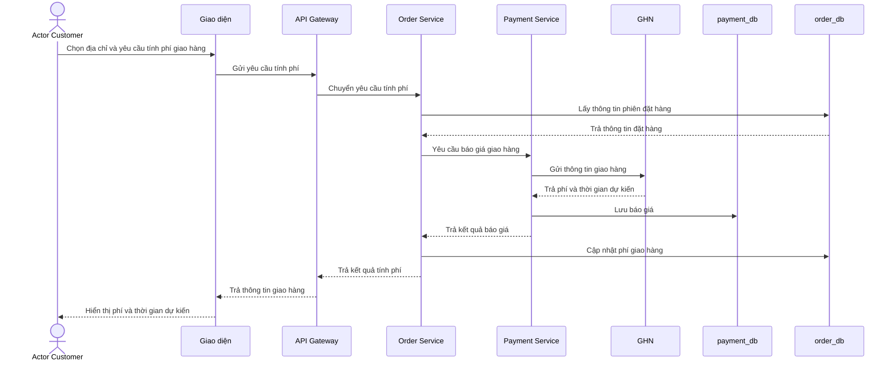

# HU01 — Tính phí giao hàng

## Lifeline

- Actor Customer
- Giao diện
- API Gateway
- Order Service
- Payment Service
- GHN
- `payment_db`
- `order_db`

## Mô tả luồng sự kiện

- **Mô tả vắn tắt:** Cho phép khách hàng xem phí giao hàng và thời gian giao dự kiến dựa trên địa chỉ nhận hàng và các sản phẩm đang đặt mua.

- **Tiền điều kiện:**

  + Khách hàng đã đăng nhập và đang có một phiên đặt hàng hợp lệ.
  + Khách hàng đã chọn hoặc nhập đầy đủ địa chỉ nhận hàng.
  + Các sản phẩm đặt mua có đầy đủ thông tin cần thiết để tính phí giao hàng.
  + Hệ thống đã được kết nối với GHN.

- **Luồng sự kiện chính và rẽ nhánh:**

| **Khách hàng (Customer)** | **Hệ thống** |
|---|---|
| **Luồng sự kiện chính** | |
| 1. Truy cập trang xác nhận đặt hàng và chọn địa chỉ nhận hàng. | 2. Hệ thống tiếp nhận địa chỉ và lấy thông tin hàng hóa trong phiên đặt hàng. |
| 3. Yêu cầu xem phí giao hàng. | 4. Order Service gửi thông tin địa chỉ và hàng hóa đến Payment Service. 5. Payment Service yêu cầu GHN tính phí giao hàng. 6. Hệ thống lưu kết quả báo giá và cập nhật vào phiên đặt hàng. |
| 7. Xem phí giao hàng, loại dịch vụ và thời gian giao dự kiến trên giao diện. | 8. Hệ thống hiển thị kết quả báo giá cho khách hàng. |
| **Luồng sự kiện rẽ nhánh** | |
| + Tại bước 1: Nếu địa chỉ chưa đầy đủ hoặc không được hỗ trợ, khách hàng chọn lại địa chỉ hợp lệ. + Sau bước 7: Nếu khách hàng thay đổi địa chỉ hoặc hàng hóa, hệ thống yêu cầu tính lại phí giao hàng. | + Tại bước 2: Nếu phiên đặt hàng không còn hợp lệ, hệ thống thông báo để khách hàng kiểm tra lại. + Tại bước 5: Nếu chưa thể lấy báo giá từ GHN, hệ thống thông báo chưa thể tính phí và cho phép thử lại. |

- **Hậu điều kiện:** Phí giao hàng và thời gian giao dự kiến được lưu cho phiên đặt hàng để sử dụng ở bước xác nhận đơn. Việc xem phí chưa tạo thanh toán và chưa hoàn tất đơn hàng.

## Sequence — DynamicMart

