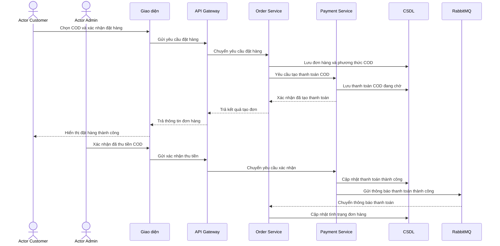

# HU02 — Thanh toán COD

## Lifeline

- Actor Customer
- Actor Admin
- Giao diện
- API Gateway
- Order Service
- Payment Service
- CSDL
- RabbitMQ

`CSDL` là lifeline trình bày gộp của `payment_db` và `order_db`.

## Mô tả luồng sự kiện

- **Mô tả vắn tắt:** Cho phép khách hàng chọn thanh toán khi nhận hàng; sau khi tiền được thu, quản trị viên xác nhận để hệ thống ghi nhận đơn hàng đã thanh toán.

- **Tiền điều kiện:**

  + Khách hàng đã đăng nhập và có đơn hàng hợp lệ cần thanh toán.
  + Đơn hàng cho phép sử dụng phương thức COD.
  + Quản trị viên đã đăng nhập và có quyền xác nhận thu tiền COD.

- **Luồng sự kiện chính và rẽ nhánh:**

| **Khách hàng / Quản trị viên** | **Hệ thống** |
|---|---|
| **Luồng sự kiện chính** | |
| 1. Khách hàng chọn phương thức COD và xác nhận đặt hàng. | 2. Hệ thống tạo đơn hàng, ghi nhận phương thức COD và tạo khoản thanh toán đang chờ. |
| 3. Khách hàng xem thông tin đơn hàng đã đặt. | 4. Hệ thống hiển thị mã đơn, số tiền cần thanh toán và trạng thái chờ thu tiền. |
| 5. Sau khi tiền được thu, quản trị viên mở thông tin thanh toán COD của đơn hàng. | 6. Hệ thống hiển thị số tiền cần thu và thông tin thanh toán của đơn hàng. |
| 7. Quản trị viên nhập thông tin xác nhận thu tiền và bấm xác nhận. | 8. Hệ thống kiểm tra thông tin, cập nhật thanh toán thành công và gửi thông báo cập nhật đơn hàng qua RabbitMQ. 9. Order Service nhận thông báo và cập nhật tình trạng thanh toán của đơn hàng. |
| **Luồng sự kiện rẽ nhánh** | |
| + Tại bước 1: Nếu đơn hàng không cho phép COD, khách hàng chọn phương thức thanh toán khác. + Tại bước 7: Nếu thông tin thu tiền chưa đúng, quản trị viên kiểm tra và nhập lại. | + Tại bước 2: Nếu đơn hàng không hợp lệ, hệ thống từ chối tạo thanh toán COD và thông báo lý do. + Tại bước 8: Nếu số tiền hoặc thông tin xác nhận không khớp, hệ thống không cập nhật thanh toán thành công. + Nếu khoản COD đã được xác nhận trước đó, hệ thống hiển thị kết quả hiện tại và không ghi nhận lần thứ hai. |

- **Hậu điều kiện:** Khoản thanh toán COD được ghi nhận thành công, thông tin xác nhận thu tiền được lưu và Order Service nhận được kết quả để cập nhật đơn hàng.

## Sequence — DynamicMart

