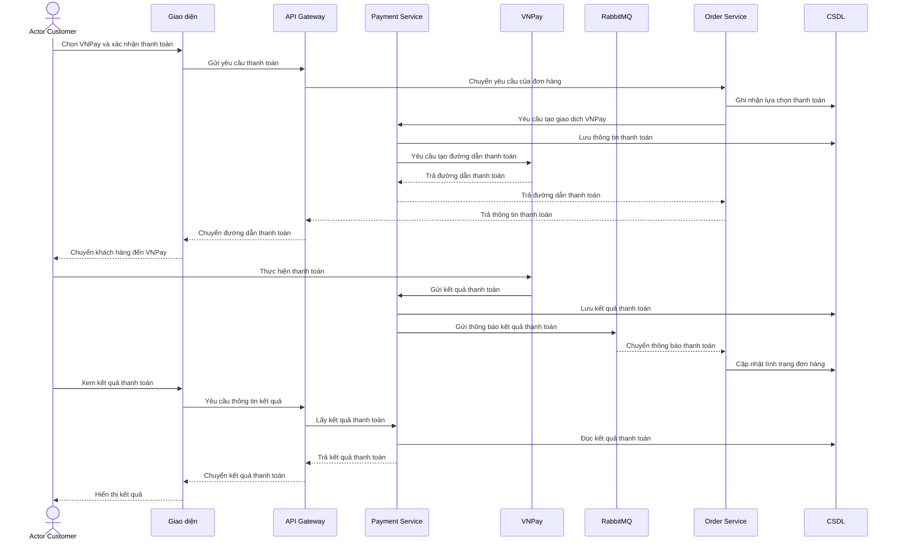

# HU03 — Thanh toán VNPay

## Lifeline

- Actor Customer
- Giao diện
- API Gateway
- Payment Service
- VNPay
- RabbitMQ
- Order Service
- CSDL

`CSDL` là lifeline trình bày gộp của `payment_db` và `order_db`.

## Mô tả luồng sự kiện

- **Mô tả vắn tắt:** Cho phép khách hàng thanh toán đơn hàng qua VNPay và xem kết quả thanh toán sau khi giao dịch được xử lý.

- **Tiền điều kiện:**

  + Khách hàng đã đăng nhập và có đơn hàng hợp lệ cần thanh toán.
  + Đơn hàng cho phép sử dụng VNPay.
  + Hệ thống đã được kết nối với VNPay.

- **Luồng sự kiện chính và rẽ nhánh:**

| **Khách hàng (Customer)** | **Hệ thống** |
|---|---|
| **Luồng sự kiện chính** | |
| 1. Chọn VNPay và xác nhận thanh toán cho đơn hàng. | 2. Hệ thống ghi nhận phương thức thanh toán và yêu cầu VNPay tạo trang thanh toán. |
| 3. Được chuyển đến trang thanh toán của VNPay. | 4. Hệ thống cung cấp thông tin giao dịch cần thanh toán cho VNPay. |
| 5. Nhập thông tin và xác nhận thanh toán trên VNPay. | 6. VNPay xử lý giao dịch và gửi kết quả về Payment Service. 7. Payment Service lưu kết quả và gửi thông báo qua RabbitMQ. 8. Order Service nhận thông báo và cập nhật tình trạng thanh toán của đơn hàng. |
| 9. Quay lại DynamicMart và xem kết quả thanh toán. | 10. Hệ thống lấy kết quả đã ghi nhận và hiển thị cho khách hàng. |
| **Luồng sự kiện rẽ nhánh** | |
| + Tại bước 5: Nếu khách hàng hủy hoặc chưa hoàn tất giao dịch, khách hàng được đưa về trang kết quả phù hợp. + Tại bước 9: Nếu kết quả đang được xử lý, khách hàng chờ hoặc tải lại để xem trạng thái mới nhất. | + Tại bước 2: Nếu không thể tạo trang thanh toán, hệ thống thông báo để khách hàng thử lại. + Tại bước 6: Nếu VNPay trả kết quả không thành công, hệ thống lưu kết quả và hiển thị trạng thái tương ứng. + Nếu cùng một kết quả được gửi lại, hệ thống không cập nhật thanh toán và đơn hàng thêm lần nữa. |

- **Hậu điều kiện:** Kết quả giao dịch VNPay được lưu trong hệ thống; Order Service nhận được thông báo để cập nhật đơn hàng và khách hàng có thể xem trạng thái thanh toán mới nhất.

## Sequence — DynamicMart

