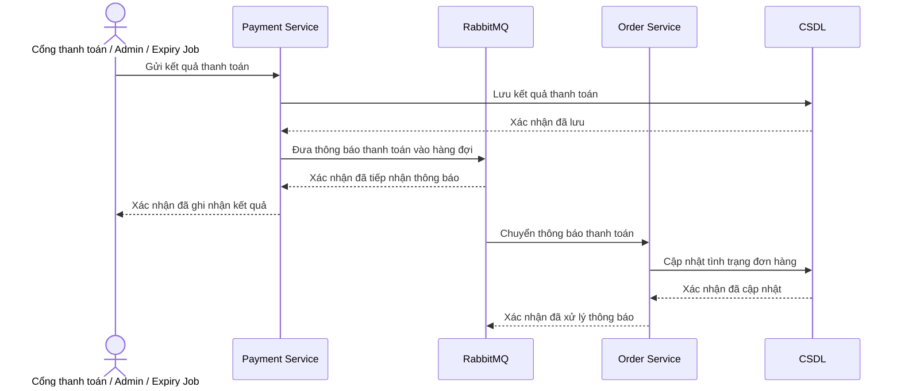

# HU04 — Xử lý kết quả thanh toán

## Lifeline

- Cổng thanh toán / Admin / Expiry Job
- Payment Service
- RabbitMQ
- Order Service
- CSDL

`CSDL` là lifeline trình bày gộp của `payment_db` và `order_db`.

## Mô tả luồng sự kiện

- **Mô tả vắn tắt:** Cho phép hệ thống tiếp nhận kết quả thanh toán từ cổng thanh toán, quản trị viên hoặc tiến trình kiểm tra hết hạn; sau đó cập nhật thanh toán và thông báo cho Order Service qua RabbitMQ.

- **Tiền điều kiện:**

  + Khoản thanh toán tương ứng đã tồn tại trong hệ thống.
  + Nguồn gửi kết quả thanh toán được hệ thống chấp nhận.
  + Payment Service, RabbitMQ và Order Service đã được cấu hình để trao đổi thông báo.

- **Luồng sự kiện chính và rẽ nhánh:**

| **Cổng thanh toán / Admin / Expiry Job** | **Hệ thống** |
|---|---|
| **Luồng sự kiện chính** | |
| 1. Gửi kết quả của một khoản thanh toán đến Payment Service. | 2. Payment Service tiếp nhận, kiểm tra và xác định khoản thanh toán tương ứng. |
| | 3. Payment Service lưu kết quả thanh toán vào CSDL. |
| | 4. Payment Service đưa thông báo kết quả thanh toán vào RabbitMQ và hoàn tất việc tiếp nhận. |
| | 5. RabbitMQ giữ thông báo trong hàng đợi và chuyển đến Order Service. |
| | 6. Order Service xử lý thông báo, cập nhật tình trạng thanh toán và tình trạng đơn hàng trong CSDL. |
| | 7. Order Service xác nhận với RabbitMQ rằng thông báo đã được xử lý. |
| 8. Nhận xác nhận rằng kết quả thanh toán đã được ghi nhận. | 9. Hệ thống trả kết quả tiếp nhận cho nguồn gửi. |
| **Luồng sự kiện rẽ nhánh** | |
| + Tại bước 1: Nếu thông tin kết quả chưa đầy đủ hoặc không đúng, nguồn gửi nhận thông báo không được chấp nhận. | + Tại bước 2: Nếu không tìm thấy khoản thanh toán hoặc kết quả không phù hợp, Payment Service không thay đổi trạng thái thanh toán. + Tại bước 3: Nếu kết quả đã được xử lý trước đó, hệ thống giữ nguyên dữ liệu và không tạo tác động lần thứ hai. + Tại bước 5: Nếu Order Service chưa sẵn sàng, RabbitMQ tiếp tục giữ thông báo và chuyển lại khi có thể. + Tại bước 6: Nếu Order Service chưa xử lý xong, thông báo chưa được xác nhận hoàn tất với RabbitMQ. |

- **Hậu điều kiện:** Kết quả thanh toán được lưu, thông báo được RabbitMQ chuyển đến Order Service và trạng thái đơn hàng được cập nhật tương ứng. Hệ thống không tạo tác động lặp khi cùng một kết quả được gửi nhiều lần.

## Vai trò của RabbitMQ

RabbitMQ làm trung gian giữa Payment Service và Order Service. Payment Service chỉ cần thông báo kết quả thanh toán một lần; RabbitMQ chịu trách nhiệm chuyển thông báo đó đến Order Service. Nhờ vậy, việc ghi nhận thanh toán và việc cập nhật đơn hàng có thể diễn ra độc lập, không yêu cầu hai dịch vụ phải xử lý cùng lúc.

## Sequence — DynamicMart

